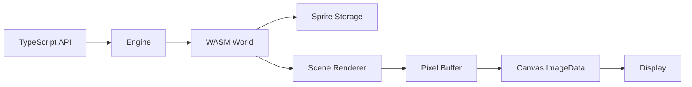

# QDDC (QDDC Data Driven Canvas)

<p align="center">
  <strong>3A Level Engine (Assemble A lot of AI)</strong><br>
   2D renderer with Rust/WASM shared memory
</p>

<p align="center">
  <a href="./README_CN.md">中文文档</a>
</p>

---

## ✨ Features

- **🚀 High Performance** - Rust-powered rendering with WebAssembly, efficient shared memory between WASM and JavaScript
- **🎨 Sprite Management** - Create, transform, and manage multiple sprites with complete transformation support
- **🔄 Matrix Transformations** - Full support for translation, rotation, and scaling operations
- **📊 Z-Index Layering** - Control sprite rendering order with z-index
- **🖼️ Multiple Sampling Methods** - Nearest neighbor, bilinear interpolation, and 2x2 supersampling
- **📦 Easy Integration** - Built with Vite for modern frontend development

## 🛠️ Tech Stack

| Layer | Technology |
|-------|-----------|
| Core Engine | Rust + wasm-bindgen |
| JavaScript Bindings | TypeScript |
| Build Tool | Vite |
| WASM Compiler | wasm-pack |

## 📁 Project Structure

```
qddc/
├── crate/                    # Rust/WASM source code
│   ├── src/
│   │   ├── lib.rs           # WASM module entry, PixelBuffer
│   │   ├── core/            # Core modules (World, Sprite, Scene)
│   │   └── math/            # Math utilities (Matrix, Vector)
│   └── Cargo.toml
├── src/                      # TypeScript source code
│   ├── engine/
│   │   ├── engine.ts        # Engine class - main API
│   │   └── sprite.ts        # Sprite class - sprite wrapper
│   ├── index.ts             # Library exports
│   └── main.ts              # Demo application
├── pkg/                      # WASM build output
└── package.json
```

## 🚀 Quick Start

### Prerequisites

- [Node.js](https://nodejs.org/) >= 18
- [Rust](https://rustup.rs/) with `wasm32-unknown-unknown` target
- [wasm-pack](https://rustwasm.github.io/wasm-pack/installer/)

### Installation

```bash
# Clone the repository
git clone https://github.com/your-username/qddc.git
cd qddc

# Install dependencies
npm install

# Build WASM module
npm run build:wasm

# Start development server
npm run dev
```

### Build for Production

```bash
npm run build
```

## 📖 API Reference

### Engine

The main rendering engine that manages sprites and the rendering pipeline.

```typescript
import { Engine } from 'qddc'

// Create engine with canvas element
const engine = await Engine.create(canvas)

// Set background color (RGBA)
engine.setBackgroundColor(20, 30, 48, 255)

// Set sampling method
engine.setSamplingMethod('bilinear')  // 'nearest' | 'bilinear' | 'supersampling'

// Render frame
engine.render()
```

### Sprite

Sprites are the basic rendering units with transformation support.

```typescript
// Create a colored rectangle sprite
const sprite = engine.createRectSprite(50, 50, 255, 0, 0, 255)  // width, height, r, g, b, a

// Create from image data
const sprite = engine.createSprite(imageData, width, height)

// Add to scene for rendering
engine.addToScene(sprite)

// Transform operations
sprite.setPosition(100, 200)      // Set position
sprite.translate(10, 20)          // Translate by offset
sprite.setRotation(Math.PI / 4)   // Set rotation (radians)
sprite.rotate(0.1)                // Rotate by angle
sprite.setScale(2, 2)             // Set scale
sprite.scaleBy(1.5, 1.5)          // Scale by factor
sprite.setZIndex(10)              // Set rendering order

// Reset transform
sprite.resetTransform()

// Remove from scene
engine.removeSprite(sprite)
```

### Sampling Methods

| Method | Description | Use Case |
|--------|-------------|----------|
| `nearest` | Nearest neighbor sampling | Pixel art, sharp edges |
| `bilinear` | Bilinear interpolation | Smooth scaling |
| `supersampling` | 2x2 supersampling | Best quality, higher cost |

## 🎮 Demo Application

The included demo provides a visual testing interface for all engine features:

- Create sprites with different colors
- Transform controls (translate, rotate, scale)
- Z-index adjustment
- Sampling method selection

Start the demo with `npm run dev` and open `http://localhost:5173`.

## 🧪 Testing

```bash
# Run Rust tests
npm run test:wasm

# Or directly with cargo
cd crate && cargo test
```

## 📋 NPM Scripts

| Script | Description |
|--------|-------------|
| `npm run dev` | Start development server |
| `npm run build` | Build WASM and TypeScript for production |
| `npm run build:wasm` | Build only WASM module |
| `npm run test` | Run tests |
| `npm run preview` | Preview production build |

## 🔧 How It Works



1. **Sprite Creation** - Create sprites via Engine API, stored in WASM memory
2. **Transformation** - Apply transforms (translate, rotate, scale) on JS side, synced to WASM
3. **Rendering** - WASM renders all visible sprites to pixel buffer
4. **Display** - JS reads pixel buffer from shared memory, draws to Canvas

## 📄 License

MIT License - see [LICENSE](LICENSE) for details.

---

<p align="center">
  Made with ❤️ and 🦀
</p>
