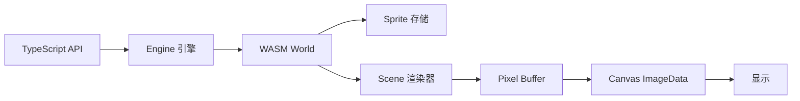

# QDDC (QDDC Data Driven Canvas)

<p align="center">
  <strong>3A 级别引擎 (Assemble A lot of AI)</strong><br>
  使用 Rust/WASM 共享内存进行 2D 图像渲染
</p>

<p align="center">
  <a href="./README.md">English</a>
</p>

---

## ✨ 特性

- **🚀 高性能** - 基于 Rust 的 WebAssembly 渲染，WASM 与 JavaScript 之间高效共享内存
- **🎨 精灵图管理** - 创建、变换和管理多个精灵图，支持完整的变换操作
- **🔄 矩阵变换** - 完整支持平移、旋转和缩放操作
- **📊 层级控制** - 使用 z-index 控制精灵图渲染顺序
- **🖼️ 多种采样方法** - 最近邻、双线性插值和 2x2 超采样
- **📦 易于集成** - 使用 Vite 构建，适配现代前端开发

## 🛠️ 技术栈

| 层级 | 技术 |
|------|-----|
| 核心引擎 | Rust + wasm-bindgen |
| JavaScript 绑定 | TypeScript |
| 构建工具 | Vite |
| WASM 编译器 | wasm-pack |

## 📁 项目结构

```
qddc/
├── crate/                    # Rust/WASM 源代码
│   ├── src/
│   │   ├── lib.rs           # WASM 模块入口，PixelBuffer
│   │   ├── core/            # 核心模块 (World, Sprite, Scene)
│   │   └── math/            # 数学工具 (Matrix, Vector)
│   └── Cargo.toml
├── src/                      # TypeScript 源代码
│   ├── engine/
│   │   ├── engine.ts        # Engine 类 - 主要 API
│   │   └── sprite.ts        # Sprite 类 - 精灵图封装
│   ├── index.ts             # 库导出
│   └── main.ts              # 示例应用
├── pkg/                      # WASM 构建输出
└── package.json
```

## 🚀 快速开始

### 前置要求

- [Node.js](https://nodejs.org/) >= 18
- [Rust](https://rustup.rs/) 并安装 `wasm32-unknown-unknown` 目标
- [wasm-pack](https://rustwasm.github.io/wasm-pack/installer/)

### 安装

```bash
# 克隆仓库
git clone https://github.com/your-username/qddc.git
cd qddc

# 安装依赖
npm install

# 构建 WASM 模块
npm run build:wasm

# 启动开发服务器
npm run dev
```

### 生产构建

```bash
npm run build
```

## 📖 API 文档

### Engine（引擎）

管理精灵图和渲染管线的主要渲染引擎。

```typescript
import { Engine } from 'qddc'

// 使用 canvas 元素创建引擎
const engine = await Engine.create(canvas)

// 设置背景色 (RGBA)
engine.setBackgroundColor(20, 30, 48, 255)

// 设置采样方法
engine.setSamplingMethod('bilinear')  // 'nearest' | 'bilinear' | 'supersampling'

// 渲染帧
engine.render()
```

### Sprite（精灵图）

精灵图是基本的渲染单元，支持变换操作。

```typescript
// 创建彩色矩形精灵图
const sprite = engine.createRectSprite(50, 50, 255, 0, 0, 255)  // 宽, 高, r, g, b, a

// 从图像数据创建
const sprite = engine.createSprite(imageData, width, height)

// 添加到场景进行渲染
engine.addToScene(sprite)

// 变换操作
sprite.setPosition(100, 200)      // 设置位置
sprite.translate(10, 20)          // 平移偏移量
sprite.setRotation(Math.PI / 4)   // 设置旋转角度（弧度）
sprite.rotate(0.1)                // 旋转指定角度
sprite.setScale(2, 2)             // 设置缩放
sprite.scaleBy(1.5, 1.5)          // 按因子缩放
sprite.setZIndex(10)              // 设置渲染顺序

// 重置变换
sprite.resetTransform()

// 从场景移除
engine.removeSprite(sprite)
```

### 采样方法

| 方法 | 描述 | 适用场景 |
|------|------|----------|
| `nearest` | 最近邻采样 | 像素艺术、锐利边缘 |
| `bilinear` | 双线性插值 | 平滑缩放 |
| `supersampling` | 2x2 超采样 | 最佳质量，性能消耗较高 |

## 🎮 演示应用

内置的演示应用提供了所有引擎功能的可视化测试界面：

- 创建不同颜色的精灵图
- 变换控制（平移、旋转、缩放）
- Z-index 层级调整
- 采样方法选择

使用 `npm run dev` 启动演示，访问 `http://localhost:5173`。

## 🧪 测试

```bash
# 运行 Rust 测试
npm run test:wasm

# 或直接使用 cargo
cd crate && cargo test
```

## 📋 NPM 脚本

| 脚本 | 描述 |
|------|------|
| `npm run dev` | 启动开发服务器 |
| `npm run build` | 构建 WASM 和 TypeScript 用于生产环境 |
| `npm run build:wasm` | 仅构建 WASM 模块 |
| `npm run test` | 运行测试 |
| `npm run preview` | 预览生产构建 |

## 🔧 工作原理



1. **精灵图创建** - 通过 Engine API 创建精灵图，存储在 WASM 内存中
2. **变换操作** - 在 JS 端应用变换（平移、旋转、缩放），同步到 WASM
3. **渲染** - WASM 将所有可见精灵图渲染到像素缓冲区
4. **显示** - JS 从共享内存读取像素缓冲区，绘制到 Canvas

## 🏗️ 架构设计

### WASM 核心

WASM 端负责：
- 存储精灵图原始像素数据
- 管理场景和渲染顺序
- 执行矩阵变换和像素采样
- 提供共享内存给 JS 端

### TypeScript 层

TypeScript 层负责：
- 提供友好的 API 接口
- 管理精灵图变换状态
- 处理用户交互
- 调度渲染循环

## 📄 许可证

MIT License - 详见 [LICENSE](LICENSE) 文件。

---

<p align="center">
  Made with ❤️ and 🦀
</p>
